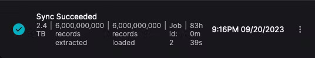
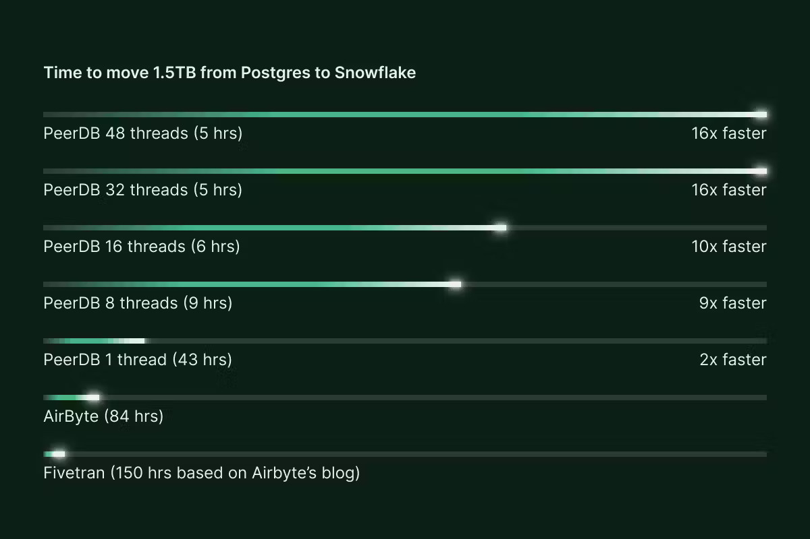
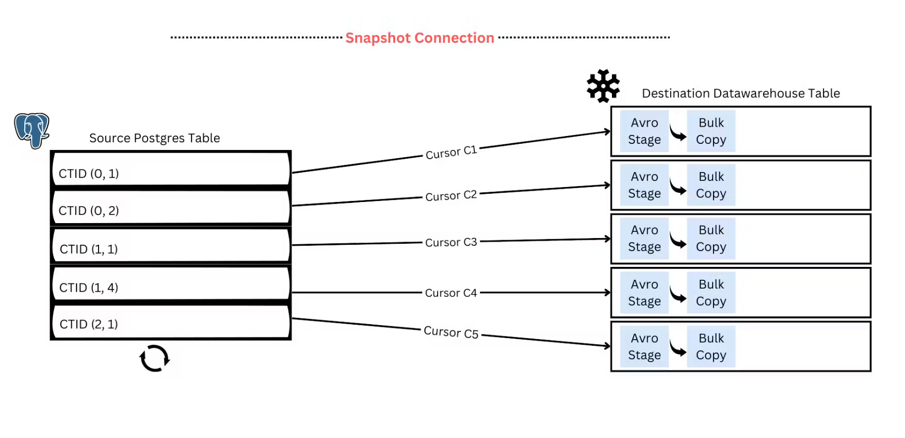

We at [PeerDB](https://www.peerdb.io/) are working on fast and simple data movement in and out of Postgres. Other data-movement tools also support the Postgres connector and have been investing in improving this. For example, [Airbyte](https://airbyte.com) has released a [series](https://airbyte.com/blog/replicate-postgres-datasets-of-any-size-in-airbyte) [of](https://airbyte.com/blog/postgres-replication-performance-benchmark-airbyte-vs-fivetran) blog posts demonstrating improvements they have made to their Postgres connector, leading to significant performance gains over [Fivetran](https://www.fivetran.com/).

In the past few weeks, we spent some time running a benchmark captured in [this](https://airbyte.com/blog/postgres-replication-performance-benchmark-airbyte-vs-fivetran) Airbyte blog. The primary goal was to understand - how we stack up against other tools, how our existing features impact performance and how can we further improve our product.

## Assumptions

Airbyte’s [benchmark](https://airbyte.com/blog/postgres-replication-performance-benchmark-airbyte-vs-fivetran) was performing a one-time transfer of a single large table from Postgres to Snowflake. Since we are moving data already present in the source table instead of incrementally moving fresh data, this is what we call a **Full Refresh** in Airbyte and an **Initial Snapshot** in PeerDB.

Benchmarking a large migration like this is highly dependent not only on the performance of the migration platform but also on the performance of the source Postgres and target Snowflake instances. Network throughput between all these parts is also crucial.

So we generated a dataset and tested PeerDB and Airbyte against it, using instances for Postgres and Snowflake which we felt best represented a production deployment. The entire infrastructure was positioned within a single AWS region, reducing network bottlenecks. More details on the setup can be found [**here**](https://github.com/PeerDB-io/ab-scale-testing#benchmark-setup)**.**

## Generating the Data

While Airbyte provided the schema of the table, it wasn’t enough to generate a dataset, as we didn’t know the size of a row or the number of rows in the table. We decided to run the test on a table with 6 billion rows and a 1.5TB size.

We worked out that each row should be around 230-235 bytes. We then arrived at a size for each variable length field that should get us the table size we wanted. We also converted one of the columns in the table to be a generated primary key because PeerDB currently [requires](https://docs.peerdb.io/usecases/Real-time%20CDC/postgres-to-snowflake#prerequisites) one for CDC mirroring.

```sql
CREATE TABLE IF NOT EXISTS public.xxxxx
    (    
      f0 BIGINT PRIMARY KEY GENERATED ALWAYS AS IDENTITY,
      f1 BIGINT,
      f2 BIGINT,
      f3 INTEGER,
      f4 DOUBLE PRECISION,
      f5 DOUBLE PRECISION,
      f6 DOUBLE PRECISION,
      f7 DOUBLE PRECISION,
      f8 VARCHAR COLLATE pg_catalog.\"default\",
      f9 VARCHAR COLLATE pg_catalog.\"default\",
      f10 DATE,
      f11 DATE,
      f12 DATE,
      f13 VARCHAR COLLATE pg_catalog.\"default\",
      f14 VARCHAR COLLATE pg_catalog.\"default\",
      f15 VARCHAR COLLATE pg_catalog.\"default\"
    )
```

After doing *all* this, we wrote a [small Rust program](https://github.com/PeerDB-io/ab-scale-testing/blob/main/src/main.rs) that could generate 6 billion rows and insert them into a Postgres instance we provisioned on AWS RDS. After some debugging, we were in business!

```rust
[2023-09-12T10:08:33Z INFO  firenibble] Finished inserting 6000000000 rows in 12689.01s seconds
[2023-09-12T10:08:33Z INFO  firenibble] Throughput: 472850.12
```

```plaintext
postgres=> SELECT pg_size_pretty(pg_relation_size('public.xxxxx'));
 pg_size_pretty
----------------
 1578 GB
(1 row)
```

## Testing!

Both AirByte and PeerDB have an Open Source offering and are available as Docker Compose Applications. So we decided to use these for our testing, on a sufficiently powerful AWS EC2 instance. To reiterate, we are only looking for the performance of the initial load, and not an incremental sync.

### Airbyte

With Airbyte, we already knew from their numbers that a run could take multiple days. So after deploying Airbyte and setting up our connectors, we kicked off a run, checking in once every few hours.

After an initial failure because of hitting a [timeout (of 72 hours)](https://github.com/airbytehq/airbyte/issues/7525#issuecomment-959778866), Airbyte completed successfully. It took **83 hours** to move the table to Snowflake.




### PeerDB

PeerDB [implements parallelism for these heavy initial loads](https://blog.peerdb.io/parallelized-initial-load-for-cdc-based-streaming-from-postgres), and we launched five runs in total with 1, 8, 16, 32 and 48 parallel threads.

With 32 and 48 threads, PeerDB moved over **1.5TB** of Postgres table in under **5 hours**. Even scaling down to 8 threads, we still see a runtime of under **9** hours. This performance derives from the optimizations PeerDB has done to make reads as efficient as possible and also the parallelism multiplier.

Airbyte does not support parallelism at the moment. We decided to do an additional run with parallelism set to 1, as a fair comparison to Airbyte. With this, we got a run time of **43** hours.

## Results

Airbyte took **83 hours** to move a 1.5TB table from Postgres to Snowflake. With a parallelism of 32 threads, PeerDB took 5 hours to do the same job. So PeerDB was **16x** faster. Even considering a single-threaded run, PeerDB is **~2x** faster. We felt that a comparison with Fivetran was out of scope for this article. Airbyte had already shown that Fivetran was slower than Airbyte and we could expect a full refresh to take **150+ hours**.



## What makes PeerDB faster?

### Parallelism

One of the more obvious reasons is our early adoption of parallelism for long-running operations such as moving large tables from Postgres to Snowflake. We do this by logically partitioning the large table based on internal tuple identifiers (CTID) and parallelly streaming those partitions to Snowflake. The implementation is inspired by this DuckDb [**blog**](https://duckdb.org/2022/09/30/postgres-scanner.html#parallel). Based on the load you can put on the source Postgres database, you can [**configure**](https://docs.peerdb.io/sql/commands/create-mirror#mirror-for-cdc) the parallelism for the sync. More details can be found in [this](https://blog.peerdb.io/parallelized-initial-load-for-cdc-based-streaming-from-postgres) blog



Large table logically partitioned based on CTID ranges and streamed in parallel, reliably and efficiently to the target data-store. During the initial load, a snapshot connection needs to be maintained to ensure data consistency on the target.

### Batching

The second is [configurable batching](https://docs.peerdb.io/sql/commands/create-mirror#mirror-for-cdc) while reading from Postgres and writing to Snowflake. If you have PeerDB running on a large machine you could have a larger batch size (ex: 1mill). This reduces the network roundtrips across Postgres, PeerDB and Snowflake thereby improving performance. Configurable batching also helps meet Snowflake's [recommendation](https://docs.snowflake.com/en/user-guide/data-load-considerations-prepare#general-file-sizing-recommendations) for faster loads. In the above tests, we configured a batch size of ~750K to meet this recommendation.

### Binary format for data transfer

This third is using [Avro](https://github.com/PeerDB-io/peerdb/pull/123) as the intermediary data format. Avro enables data to be stored in binary (compressed) format and still supports a [**wide variety of data types**](https://avro.apache.org/docs/1.10.2/spec.html#schema_complex) (unlike parquet). This enables fast data movement, without compromising data integrity.

### Glimpses into the future

We are working on multiple other features incl. concurrent reading of the replication slot during the Initial Snapshot; parallelized writing of Change Data Capture to Target tables; and others to further improve performance

## Closing Remarks

Keeping performance aside, we were quite impressed with Airbyte's web interface and a staggering variety of connectors. We would recommend it if the breadth of available connectors is more important to you.

At PeerDB we instead have a laser focus on Postgres with the primary goal of providing the highest quality source and destination connectors for it.

If Postgres is a central part of your data stack and you want to stream data from Postgres to data warehouses, message queues or storage engines faster, simpler and cheaper, **come talk to us** [**here**](https://www.peerdb.io/sign-up). You could also try out our free and open offering [here](https://github.com/PeerDB-io/peerdb).

If you want to try benchmarking PeerDB and Airbyte yourself, we have put info about our benchmark [here](https://github.com/PeerDB-io/ab-scale-testing).
