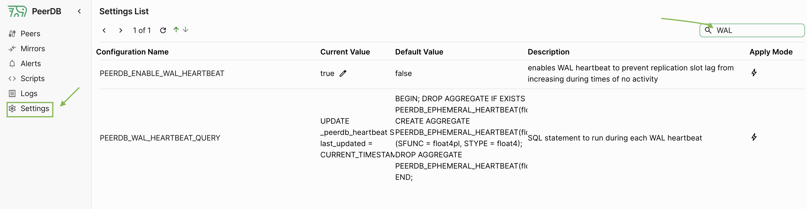

<Info>
**Disclaimer**: The below guide is more relevant if you are using read replicas or your Postgres instance is below Postgres 14.
For Postgres versions 14 and above, PeerDB now has inbuilt functionality to mitigate slot growth by default.
</Info>

Consider a scenario where you kick off a CDC mirror from PostgreSQL to a data warehouse to sync one table. The mirror creates a logical replication slot in PostgreSQL to stream changes.
Now, this table rarely gets rows ingested to it on the source. However, the replication slot keeps growing because of the WAL logs generated by the changes in other tables. This can lead to the database disk getting filled up.

This is common in development or staging environments where the database is not used heavily.

In order to mitigate this, you can create a `heartbeat` table in the source database.

## Creating a `heartbeat` table on Postgres

This table will have a single row that gets updated every minute.
By including this table in the CDC mirror, PeerDB will pick up changes to this table, sync them and flush the slot periodically, keeping the slot size in check.

The below is an example of what we're talking about. Ensure that the heartbeat table has [required permissions](/connect/postgres/rds_postgres#creating-peerdb-user-and-granting-permissions) to be a part of the mirror.


```sql
CREATE TABLE _peerdb_heartbeat (
  id SERIAL PRIMARY KEY,
  last_updated TIMESTAMP DEFAULT CURRENT_TIMESTAMP
);

INSERT INTO _peerdb_heartbeat DEFAULT VALUES;

-- Update the row every minute (this can be done with, say, pg_cron)
UPDATE _peerdb_heartbeat SET last_updated = CURRENT_TIMESTAMP;
```

### PeerDB Implementation
PeerDB has the facility to perform periodic updates on your heartbeat table.
This has the benefit of not needing to install an extension like pg_cron.
Currently, updates are done every 12 minutes. This will soon be configurable.
PeerDB will require update permission on the heartbeat table:
```sql
GRANT UPDATE ON _peerdb_heartbeat TO <postgres_peer_user>;
```
In PeerDB UI, head over to `Settings` in the sidebar. Search for `WAL` in the search bar on the right.

Edit the current value fields of the following settings:
- `PEERDB_ENABLE_WAL_HEARTBEAT`: Set this to `true` (no quotes or anything)
- `PEERDB_WAL_HEARTBEAT_QUERY`: Set this to the update command to be run periodically:
```sql
UPDATE _peerdb_heartbeat SET last_updated = CURRENT_TIMESTAMP;
```



This sets up updates to the heartbeat table every 12 minutes.

### Manual Implementation
Periodic update can also be done with the below pg_cron command, for example:

```sql
-- updates every 30 seconds
SELECT cron.schedule('*/30 * * * *', $$UPDATE _peerdb_heartbeat SET last_updated = CURRENT_TIMESTAMP$$);
```
## Include the heartbeat table in the mirror
Now, you can include it as part of the tables in the mirror either via the Create Mirror UI or through the SQL Layer as shown below.
```sql
CREATE MIRROR heartbeat_mirror
FROM postgres_peer TO warehouse_peer
WITH TABLE MAPPING (
public._peerdb_heartbeat: _peerdb_heartbeat_target,
-- other tables
)
WITH(
 ...
);
```

For an existing mirror, the [mirror can be edited](/features/edit-mirror) to add this table.
