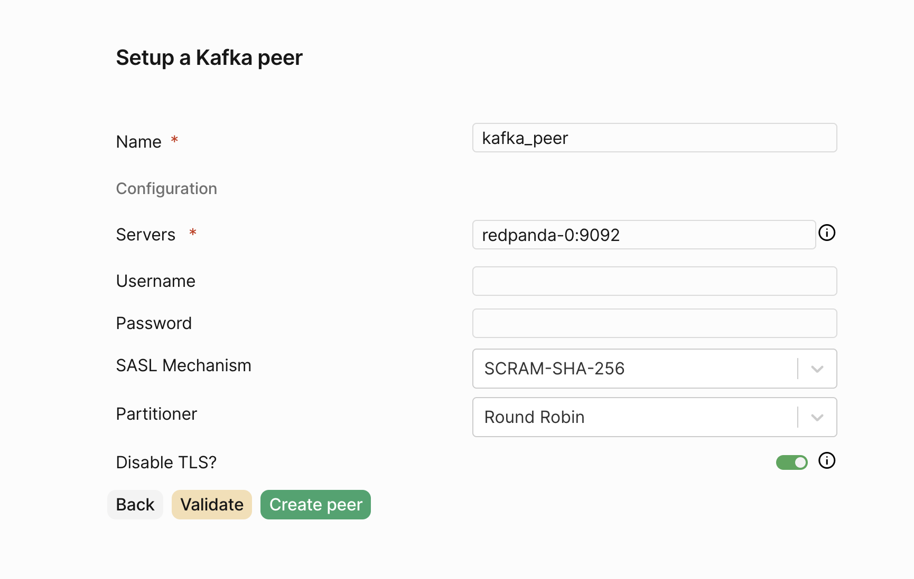

# Prerequisites

To connect Confluent Cloud to PeerDB, you need a Confluent Cloud account with Kafka Server running.

# Setup Instructions

## Gather the following details from Confluent Cloud

```toml
bootstrap.servers=<host>:9092
security.protocol=SASL_SSL
sasl.mechanisms=PLAIN
sasl.username={{ CLUSTER_API_KEY }}
sasl.password={{ CLUSTER_API_SECRET }}
```

<div style={{ position: 'relative', paddingBottom: '55.5%', height: 0 }}>
  <iframe 
    src="https://www.loom.com/embed/91b31f45c7f04f2f9c1466996e185d62?sid=4cafc614-1651-449c-9790-25b4d7b58199" 
    allowFullScreen 
    style={{ position: 'absolute', top: 0, left: 0, width: '100%', height: '100%', border: 'none' }} 
  />
</div>

## Create the Kafka Peer

And then in UI you can create the Confluent Cloud / Kafka peer like so:


1. Click on `Create Peer`
2. Select `Kafka`
3. For `Name` use a desired name, e.g. `confluent_kafka_1`, only lowercase alphanumeric and underscores are allowed.
4. For `Bootstrap Servers` use the `bootstrap.servers` value from the previous step. Multiple servers can be specified as a comma separated list.
5. For `Security Protocol` use `SASL_SSL`.
6. For `SASL Mechanism` use `PLAIN`.
7. For `Username` use the `CLUSTER_API_KEY` from the previous step.
8. For `Password` use the `CLUSTER_API_SECRET` from the previous step.
9. Click `Validate Connection`
10. Click `Create Peer`


<Warning>
PeerDB only supports plaintext and SASL authentication. If username isn't supplied then PeerDB will attempt to connect without authentication.
</Warning>

<Note>
Partitioner can be usually be ignored; it maps to partitioning strategies in [franz-go.](https://pkg.go.dev/github.com/twmb/franz-go/pkg/kgo#Partitioner) To set partitioning keys you'll need to specify `Script` when creating mirror, see [Lua reference](https://docs.peerdb.io/lua/reference) for details.
</Note>

