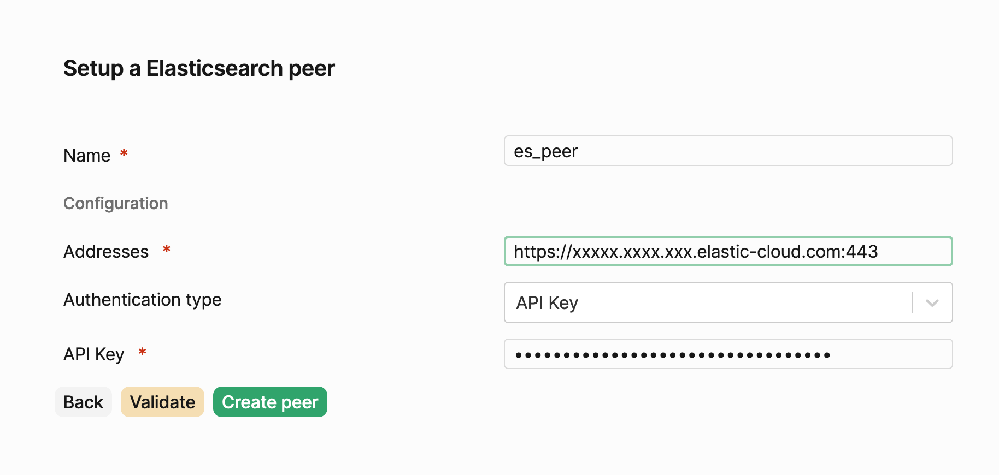

# Prerequisites
PeerDB can authenticate with Elasticsearch via either basic auth or an API key, or no auth at all. In general, Elasticsearch Cloud authenticates via API keys and self-hosted Elasticsearch can vary. If applicable, atleast the following privileges need to be granted to the PeerDB role: `auto_configure`, `create_doc`, `write`.

## Create the Elasticsearch Peer

1. From the PeerDB home page, click on `Create Peer` and then on `Elasticsearch`. 
3. Name the peer as desired, only lowercase alphanumeric and underscores are allowed.
4. The server to connect to should be specified in `Addresses`. Multiple servers can be specified as a comma separated list.
5. Depending on the desired authentication type, choose one of `None, `Basic Auth` or `API Key` and fill in the required fields.
6. Click `Validate`, If validation succeeds, finish by clicking `Create Peer`.

