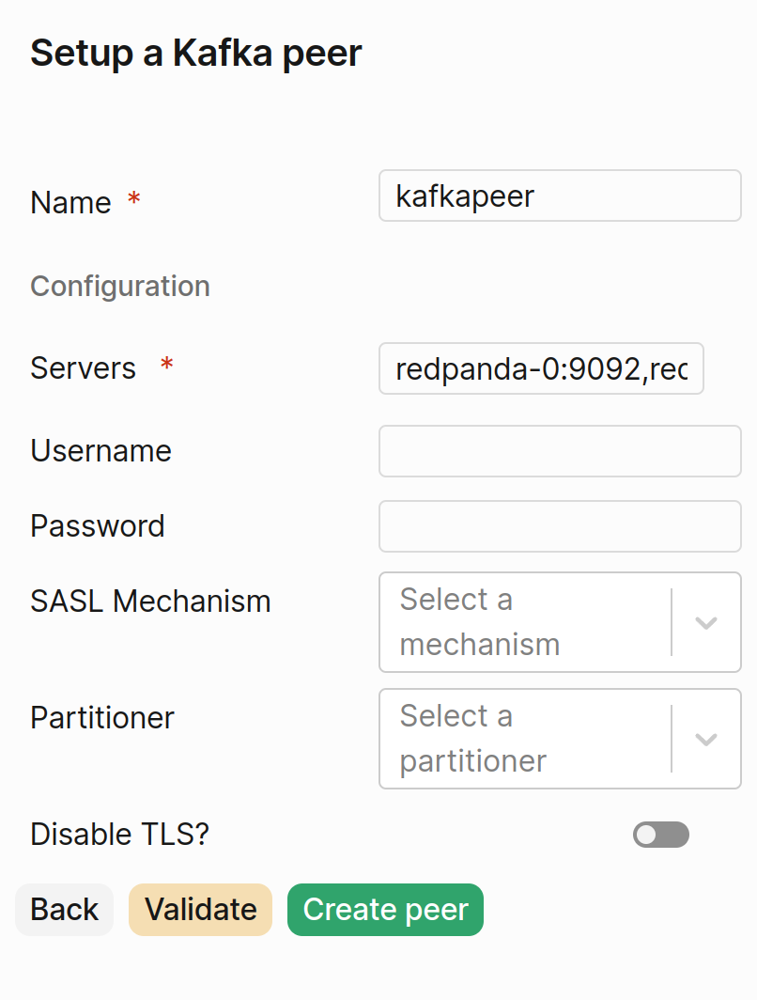

If looking to try out without an already setup Kafka endpoint, [see Redpanda quickstart,](https://docs.redpanda.com/current/get-started/quick-start) by default no authentication is necessary.

PeerDB only supports plaintext & sasl authentication. If username isn't supplied then PeerDB will attempt to connect without authentication.

Multiple servers can be specified as a comma separated list.

Partitioner can be usually be ignored; it maps to partitioning strategies in [franz-go.](https://pkg.go.dev/github.com/twmb/franz-go/pkg/kgo#Partitioner) To set partitioning keys you'll need to specify `Script` when creating mirror, see [Lua reference](https://docs.peerdb.io/lua/reference) for details.