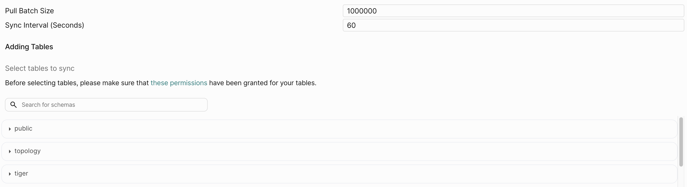

PeerDB allows you to [pause a CDC mirror](/features/pause-mirror) during CDC and then do three things:
1. Edit the pull batch size of the mirror.
2. Edit the sync interval of the mirror.
3. Add tables to the mirror

### Use-cases for editing a mirror
PeerDB reads the slot until either the sync interval amount of time is reached, or pull batch size amount of records have been read from the slot.
Then, PeerDB flushes (syncs) the records it has read to the destination.

Based on that, you may want to, say, reduce the sync interval so that you get your data quicker.
Or, if let's say you're syncing to a data warehouse where frequent writes are expensive, you would want to have a high pull batch size and sync interval so that you sync less frequently.

## Edit Mirror Guide
Select the mirror you created from the Mirrors page:

In order to edit the mirror, it needs to be paused first. We can click on the **Pause** button under **Status** in the **Overview** tab:

Once clicked, you can refresh the page and see that the **Status** is now **Paused**.

Now, we can click on the **Edit** button under **Actions** in the **Overview** tab:

This takes to the **Edit Mirror** page where you can edit the **Pull Batch Size** and **Sync Interval**:

Once you have made the changes, click on the **Edit Mirror** button in the bottom right. This will take you back to the **Overview** tab where you the status of the mirror will be **Running**.

### Adding Tables
You can add tables in the Edit Mirror page by clicking on any of the schemas and selecting tables.

After selecting them and clicking **Edit Mirror**, you will be taken to the Overview tab where the **Status** will be **Snapshot**.

This indicates that the **initial load** of the new tables are ongoing. While the new tables are being added, the syncing of the existing tables of the mirror will be **paused** until the table is added.

<Note>Your replication slot **will grow** in the period where you're adding tables. Depending on the use case, consider creating a separate mirror instead.</Note>

Once the table is added, the **Status** will change to **Running** and the CDC syncs of the other tables along with the new ones will resume.
