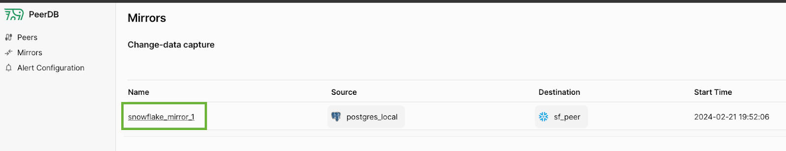

PeerDB allows you to pause a CDC mirror during CDC and then do three things:
1. Edit the pull batch size of the mirror.
2. Edit the sync interval of the mirror.
3. Add tables to the mirror

### Why would I edit the pull batch size and/or the sync interval of the mirror ?
PeerDB's sync logic reads the slot until either the sync interval amount of time is reached, or pull batch size amount of records have been read from the slot.
Then, PeerDB flushes (syncs) the records it has read to the destination.

Based on that, you may want to, say, reduce the sync interval so that you get your data quicker.
Or, if for some reason your slot size is growing and you want to suck it up, you can increase the pull batch size and the sync interval.

### Why would I edit the sync interval of the mirror ?
1. You could want to first run some initial set of validations and analysis on synced data.
2. You could want to edit the mirror.

## Pause Mirror Guide
The prerequisites for this guide are as follows:
1. You have [a PeerDB setup running].
2. You've [kicked off a CDC mirror](https://localhost:3001/quickstart/quickstart#real-time-cdc)

First, select the mirror you created from the Mirrors page:

Once the mirror is in `Running` state, we can click on the **Pause** button under **Status** in the **Overview** tab:

Once clicked, you can refresh the page and see that the **Status** is now **Paused**. To resume, we can click on the same icon button which now denotes Resume:

Refresh the page and now the **Status** should be back to **Running**.