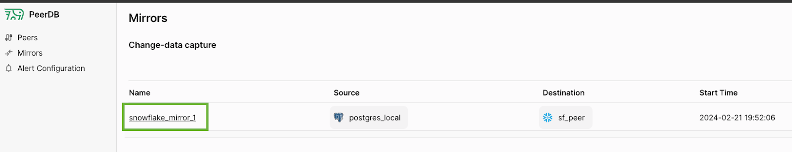
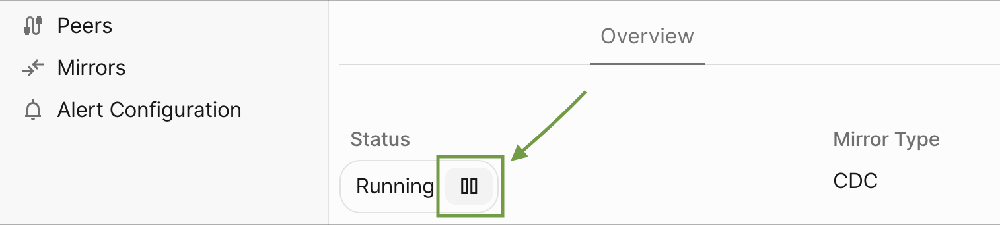
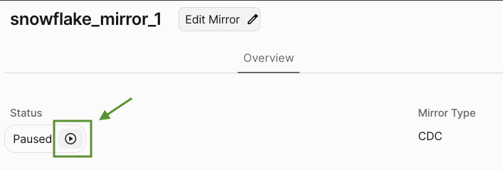

PeerDB allows you to pause and resume a Change-Data Capture mirror.
1. As of today, mirrors can only be paused during CDC and not during initial load or query replication.
2. The PostgreSQL source replication slot will still exist and it **will continue to grow** as long the mirror is paused.
3. Pausing a mirror enables you to then add tables to the CDC mirror, along with editing the Sync Interval and Pull Batch Size.

### Why would I pause a mirror ?
1. You could want to run some initial set of validations and analysis on synced data.
2. You could want to [edit the mirror](/features/edit-mirror).

## Pause Mirror Guide
The prerequisites for this guide are as follows:
1. You have [a PeerDB setup running](/quickstart/quickstart#deploying-peerdb).
2. You've [kicked off a CDC mirror](/quickstart/quickstart#real-time-cdc)

First, select the mirror you created from the Mirrors page:

Once the mirror is in `Running` state, we can click on the **Pause** button under **Status** in the **Overview** tab:

Once clicked, you can refresh the page and see that the **Status** is now **Paused**. To resume, we can click on the same icon button which now denotes Resume:

Refresh the page and now the **Status** should be back to **Running**.