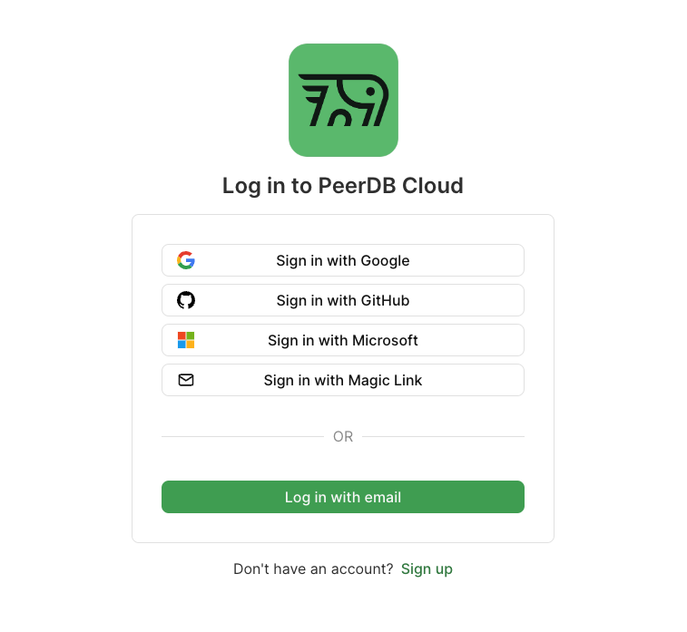
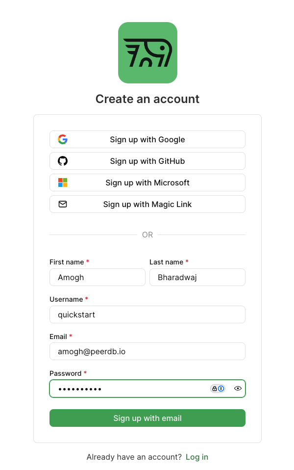
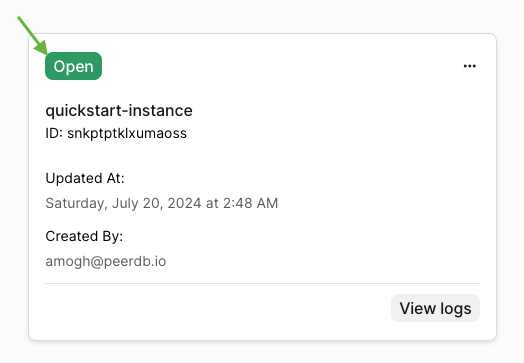

### PeerDB Cloud
PeerDB Cloud is a fully managed service that allows you to replicate data across different data stores. It is designed to be easy to use and requires no infrastructure management. You can get started with PeerDB Cloud in a few simple steps.

Let's head over to [https://app.peerdb.cloud](https://app.peerdb.cloud) to get started.
### Sign Up
Upon landing on [PeerDB Cloud](https://app.peerdb.cloud), we will be greeted with the login page.

Since we're new, let's click on **Sign Up**. This takes us to the sign-up page. Let's fill in the details and click on **Sign Up**.

### Creating an instance
We will be taken to the PeerDB Cloud Dashboard. We can now create a PeerDB instance. Let's click on **Create Instance** to get started.

This takes us to the **New Instance** page. Let's briefly talk about the form:
- **Name**: The name of the instance. This can be to your liking.
- **Password**: The password for the instance. This is used to connect to the instance, so make sure to note it down. For this quickstart, let's assume the password to be `quickstart`.
- **Version**: The version of PeerDB to use. For this quickstart, let's select the provided version in the dropdown.

The **PeerDB Micro** instance is default and is sufficient for this quickstart. Let's click on **Continue**.

This takes us to the **Confirm** page. Let's click on **Create Instance** to create the instance.

That's it! We should now be able to see our instance in the dashboard.

The instance will take a minute to get ready. We should then, upon a page refresh, see the running instance:

Let's click on **PeerDB UI** to head over to PeerDB UI

### PeerDB UI
We will be directed to the PeerDB UI login page. The password for this instance is the one we set during the instance creation. 
In our case, that is `quickstart`.
Let's fill in the password and click on **Sign in with Password**.

We have landed at the **PeerDB UI dashboard**!

Please do check out the [PeerDB UI Quickstart Guide](../quickstart/quickstart) to create peers, mirrors, and much more. 
