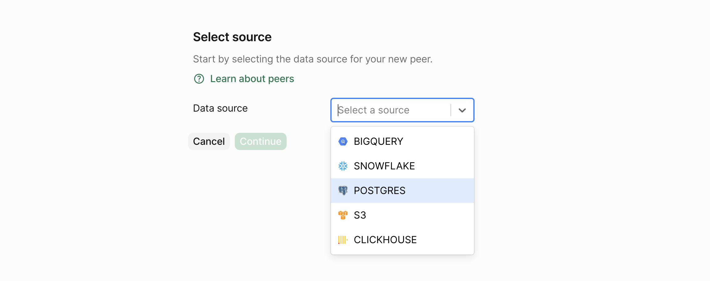
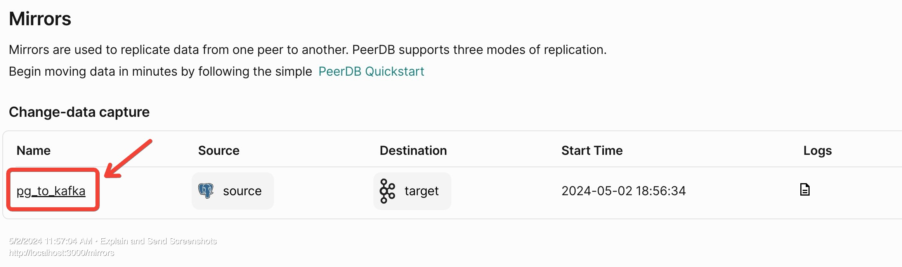

### Deploying PeerDB

We currently support deploying and testing PeerDB using our Docker Compose file.

<Info>
  {" "}
  Docker can be installed by referring to [these instructions](https://www.docker.com/products/docker-desktop).
  The `docker compose` tool should also be present. The Postgres client tools (specifically
  `psql`) are used to test the PeerDB installation.{" "}
</Info>

**Run the following commands in your terminal:**

    ```bash
    git clone --recursive https://github.com/PeerDB-io/peerdb.git
    cd peerdb

    # Run docker containers: peerdb-server, postgres as catalog, temporal.
    # This might take a few minutes, so get a cup of coffee! :)
    ./run-peerdb.sh
    ```

That's it! You now have PeerDB up and running on your machine, ready to query away!

### Quickstart

<Info>
  {" "}
  The following steps assume you have PeerDB running locally. We also need `psql` installed and available on your
  PATH.
</Info>

## Setup

This script reuses the PeerDB internal Postgres instance to setup two databases, which we can use to create two peers. It also creates some tables on both databases to use later in the quickstart. Run the following commands in your terminal:

```bash
curl -O https://peerdb-sample-data.s3.us-east-2.amazonaws.com/quickstart_prepare_peers.sh
chmod +x quickstart_prepare_peers.sh
./quickstart_prepare_peers.sh
```

### Creating Peers

With PeerDB running, we can create our first peers.

Head over to `localhost:3000` on your browser. This is the PeerDB Dashboard.

Clicking on **Peers** in the sidebar will take us to the **Peers** page.

#### Creating Source Postgres Peer

Let's click on the Create Peer button at the top right to get started.


Now, we select the data store for which we wish to create a peer. Let's select **Postgres** and click on the **Continue** button.


This takes to a form where we can fill in the details for the peer. Let's fill in the details of our PostgreSQL peer.

Fill in the **password** as `postgres`.


PeerDB validates the connection details and if everything is correct, clicking on **Validate** should show a success message.

Finally, click on **Create** to create the peer.

We now have our **source PostgreSQL peer** ready.

#### Creating Target Kafka Peer

Let's create the **target Kafka peer**.

First lets start a local Kafka (or Redpanda) instance.

```bash
mkdir redpanda-setup && cd redpanda-setup
curl -O https://docs.redpanda.com/redpanda-labs/docker-compose/_attachments/single-broker/docker-compose.yml
docker compose up -d

# connect to the peerdb_network network
docker network connect peerdb_network $(docker container ls -qf "name=redpanda-0")
docker network connect peerdb_network $(docker container ls -qf "name=redpanda-console")
```

Once you go to the create peers page, select Kafka as the option.


Fill in the various fields:

* Name: `target`
* Servers: `redpanda-0:9092`
* SASL Mechanism: `Scram SHA 256`
* Partitioner: `Least Backup`
* Disable TLS: `true`


Then click the **Create Peer** button.

Clicking on **Mirrors** in the sidebar will take us to the **Mirrors** page.


#### Real-time CDC

Lets start by creating a CDC mirror. In the side-bar click on **Mirrors**, and then **CDC Mirror**.


Scrolling down, we can see a section to a **select the table** on our source PostgreSQL peer to sync.


Let's select the table we have ready - `public.test`.
Now that we've filled in all the mirror details.

Let's click on **Create Mirror**, which will validate to check if everything is set up correctly, much like we did when creating peers and then will create the mirror.


Connect to PeerDB via psql:

```bash
psql "port=9900 host=localhost password=peerdb"
```
And now we can run the below commands.
```sql
--- Verify that the source table has zero rows
SELECT id,c1,c2,t FROM source.public.test;
```

```sql
--- Insert a row into the source table
INSERT INTO source.public.test(c1, c2, t) VALUES(1, 2, 'oathbringer');
```

Within a minute, the row should be replicated to the target table. Let's click the mirror link on the `Mirrors` page which we landed on after creating the mirror:


This takes to the **Mirror Overview** page. Let's click on the **Sync Status tab**, where we can see the status of the mirror and the number of rows replicated:


We can see that the mirror has successfully replicated the row from the source to the target peer. Let's verify this by querying the target topic.

Head over to [Redpanda Console](http://localhost:8080/topics), click on the `public.test` topic:


The above MIRROR takes care of replicating all future DML commands (`INSERT`, `UPDATE`, `DELETE`) from source to target.

### FAQ

If you have any questions about the PeerDB setup and deployment process, don't hesitate to reach out on [Slack](https://join.slack.com/t/peerdb-public/shared_invite/zt-1wo9jydev-EXInbMtCtpAKFFWdi7QvLQ). We're more than happy to assist and answer any questions, including:

- What is the performance I can expect during CDC and query based replication?
- How do I know my data sync is successful?
- Can I set a specific time to start my data sync?

If there are any unanswered questions, we'd love to help you get started. Feel free to ask your questions on our community [Slack](https://join.slack.com/t/peerdb-public/shared_invite/zt-1wo9jydev-EXInbMtCtpAKFFWdi7QvLQ) channel.

In addition to this, if you require direct access to our team for any assistance, don't hesitate to contact us to discuss our premium support offerings.
