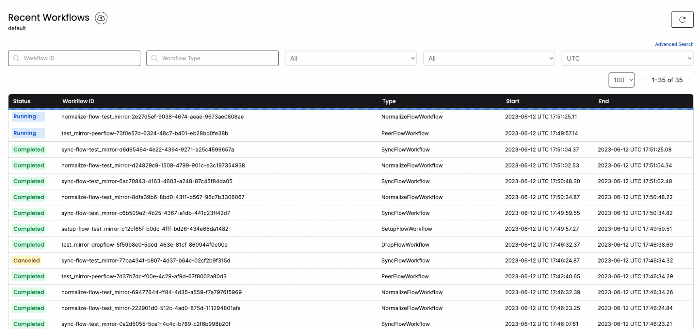

Let's look at how we can seamlessly perform Change-Data Capturing (CDC) from PostgreSQL to PostgreSQL.

### Demo

This demo shows PeerDB syncing a table with 100 million rows from PostgreSQL to PostgreSQL in few minutes using parallelized initial load and change data capture.
<div style={{ position: "relative", paddingBottom: "56.25%", height: 0 }}>
  <iframe
    src="https://www.loom.com/embed/c2a3191efaed4c1abe399ddd08600076?sid=5a465aa5-4dd4-4b9c-91cc-f3074d22ca2d"
    frameBorder={0}
    webkitallowfullscreen=""
    mozallowfullscreen=""
    allowFullScreen=""
    style={{
      position: "absolute",
      top: 0,
      left: 0,
      width: "100%",
      height: "100%"
    }}
  />
</div>

### Scenario

Suppose you have a banking application running on PostgreSQL. There are two tables: "users" and "transactions." You want to sync these tables in real-time to another PostgreSQL server. Let's see how we can make this happen within a few minutes and a few SQL commands using PeerDB.

### Prerequisites

1. Enable logical decoding in Postgres. Ensure that the following settings/GUCs are properly configured:
    1. wal_level: logical
    2. max_wal_senders: >1
    3. max_replication_slots: 4
2. Enable replication access for a PostgreSQL user - ALTER USER pg_user REPLICATION;
3. Ensure that both tables have primary keys. Composite primaries are also fine.
4. If you are using PostgreSQL on the cloud, below links capture how to enable logical replication for each cloud:
    1. [AWS RDS and Aurora PostgreSQL](https://docs.aws.amazon.com/AmazonRDS/latest/AuroraUserGuide/AuroraPostgreSQL.Replication.Logical.html#AuroraPostgreSQL.Replication.Logical.Configure)
    2. [Azure Database for PostgreSQL - Flexible Server](https://learn.microsoft.com/azure/postgresql/flexible-server/concepts-logical#pre-requisites-for-logical-replication-and-logical-decoding)
    3. [GCP Cloud SQL PostgreSQL](https://cloud.google.com/sql/docs/postgres/replication/configure-logical-replication#configure-your-postgresql-instance)

### Step 1: Create Two PostgreSQL Peers

Run the following commands to let PeerDB know about the existingpeers.

```sql
-- Connect to PeerDB
psql "port=9900 host=localhost password=peerdb"

-- Add Postgres and PostgreSQL peers
CREATE PEER postgres_peer_1 FROM postgres (...);
CREATE PEER postgres_peer_2 FROM postgres (...);
```

Make sure to replace **`(…)`** with the appropriate connection details for the two PostgreSQL instances. More details on adding PEERs are available [here](/sql/commands/create-peer).

### **Step 2: Real-Time CDC from PostgreSQL to PostgreSQL**

With the peers set up, you can create a mirror that facilitates real-time CDC from PostgreSQL to PostgreSQL. 

```sql
-- Real-time CDC between two Postgres peers
-- Make sure tables are schema qualified
CREATE MIRROR real_time_cdc
FROM postgres_peer_1 TO postgres_peer_2
WITH TABLE MAPPING (public.transactions:public.transactions, public.users:public.users)
WITH (
  do_initial_copy = true,
  snapshot_sync_mode='sql',
  snapshot_num_rows_per_partition = 500000,
  snapshot_max_parallel_workers = 4,
  snapshot_num_tables_in_parallel = 4
); 
```

If you observe, **TABLE MAPPING** represents the table name mapping between the two Postgres peers. The final `WITH` clause captures if you wanted to include initial snapshot as a part of the MIRROR. If you don't include that `WITH`, peerdb assumes that you don't want to perform an initial snapshot. If just reads the slot and replays the changes to the target.

### **Step 3: Validate the Mirror**

Through the same PeerDB's Postgres-compatible SQL interface, you can quickly validate the MIRROR (real-time CDC).

```sql
-- Validate the mirror
SELECT COUNT(*) FROM postgres_peer_1.public.transactions;
SELECT COUNT(*) FROM postgres_peer_2.public.transactions;
```

### Step 4: Monitor the MIRROR

You can connect to [`localhost:8085`](http://`localhost:8085`) to get full visibility into the different jobs and steps that PeerDB is taking under the covers to manage the MIRROR.


