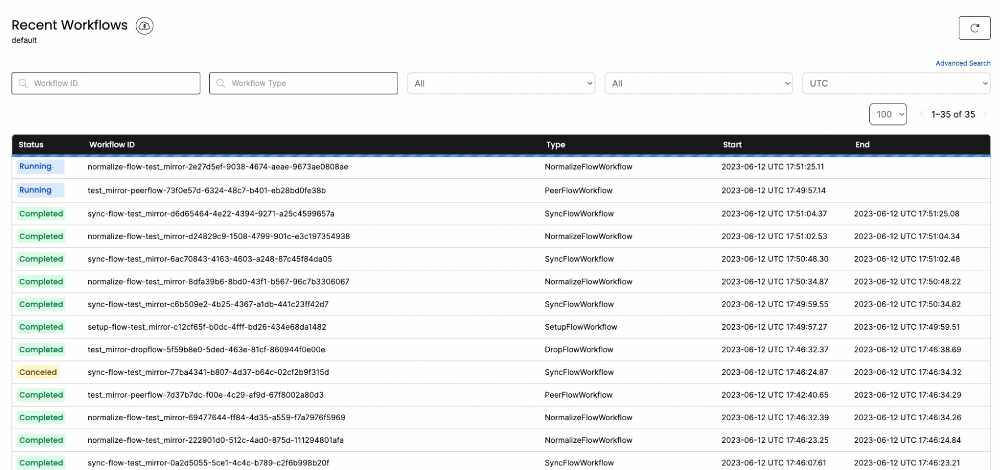

PeerDB introduces the **CREATE MIRROR FOR SELECT** SQL command for continuous sync of data from PostgreSQL to BigQuery or Snowflake based on any SELECT query on PostgreSQL. This command allows you to perform a pre-transform of the data on the source before syncing it to the target.

1. You simply run a few SQL commands, and PeerDB takes care of all the heavy lifting to set up and maintain highly performant syncs and pre-transforms across stores.
2. You can run any SELECT query that is supported by PostgreSQL for the transformation, including JOINs, function/procedure calls, GROUP BYs, and so on.
3. The SQL command provides various options such as batch size, parallelism, and refresh interval, which give you granular control when configuring the MIRROR.

>PeerDB internally implements multiple optimizations to provide the best possible performance experience. For example, it converts data to [Avro](https://github.com/PeerDB-io/peerdb/pull/96) format during transit and enables parallelism during both reading from sync and writing to target.
>
### Scenario

Let's consider a scenario where we have an "events" table and a "users" table in PostgreSQL. We want to periodically sync data from these two tables in PostgreSQL to Snowflake. However, we only want to sync a few columns filtered based on the country (USA) and create a single denormalized view of the data in Snowflake. Let's see how we can achieve this within a few minutes and a few SQL commands using PeerDB.

### Step 1: Add PostgreSQL and Snowflake Peers

Run the following commands to add the PostgreSQL and Snowflake Peers to PeerDB:

```sql
-- Connect to PeerDB
psql "port=9900 host=localhost password=peerdb"
 
-- Add PostgreSQL and Snowflake peers
CREATE PEER postgres_peer FROM postgres (...);
CREATE PEER snowflake_peer FROM snowflake (...);
```

Make sure to replace `(…)` with the appropriate connection details for both the PostgreSQL and Snowflake instances. More details on adding peers are available [here](https://docs.peerdb.io/sql/commands/create-peer).

### **Step 2: Set up MIRROR to Transform and Sync Data**

With the peers set up, you can create a mirror that facilitates periodic sync from PostgreSQL to Snowflake with custom transformations.

```sql
-- Customizable ETL from PostgreSQL to Snowflake
CREATE MIRROR customizable_etl
FROM postgres_peer TO snowflake_peer FOR
SELECT user_id, country, to_json(payload)
FROM events JOIN users ON events.user_id = users.id
WHERE country = 'USA' AND events.updated_at BETWEEN {{.start}} AND {{.end}}
WITH OPTIONS (watermark = 'updated_at', watermark_table = 'events',
mode = 'upsert', parallelism = 8, unique_key = 'user_id');
```

1. In the SELECT query, we address the scenario by choosing only a few columns, enriching some columns using the JOIN operation, and filtering based on the country.
2. The OPTIONS clause provides granular control when configuring the MIRROR:
    1. **watermark_column (Required)** represents a sequentially incrementing integer or timestamp column. PeerDB uses this column to keep track of the processed rows and the ones that need to be processed.
    2. **watermark_table (Required)** is the table that PeerDB iterates sequentially based on the watermark_column. The fact table is a good candidate for the watermark_table.
    3. **mode (Required)** tells PeerDB whether it should append data to the target or perform an upsert operation (update if the row exists).
        1. If your data is append-only, a sequential ID or a created_at column can be a good watermark, and you can choose the mode **append_only.**
        2. If your data is updated, make sure to have an "updated_at" column for PeerDB to identify the most recent version of the row. Choose the mode **upsert** to update already existing rows on the target.
            1. **unique_key:** In the upsert mode, you need to specify a set of columns (unique_key) that uniquely identify a row. This helps perform the upsert operation.
    4. **parallelism (Optional)** represents the number of threads used to read from the source and sync to the target. This helps with workload management on the source and target.
        1. If you have a powerful PostgreSQL server or if it is a read-replica, you can configure a higher parallelism value. In scenarios where you want to put less load on the source, you can choose a lower value.
    5. **refresh_interval (Optional)** helps configure the frequency (in minutes) at which the sync should run. If not specified, PeerDB syncs the data continuously without pauses.
3. `updated_at BETWEEN {{.start}} AND {{.end}}` in the SELECT statement provides input to PeerDB on which part(s) of the query should be scoped by the watermark column for the rows to be synced.

### **Step 3: Validate the Mirror**

Using the same PostgreSQL-compatible SQL interface of PeerDB, you can quickly validate the MIRROR.

```sql
-- Validate the mirror
SELECT COUNT(*) FROM snowflake_peer.events;
```

### Step 4: Monitor the MIRROR

You can connect to [localhost:8233](http://localhost:8233) to gain full visibility into the different jobs and steps that PeerDB performs under the hood to manage the MIRROR.



### Step 5: DROP MIRROR

To make it easy in your development and test environments, PeerDB also introduces the DROP MIRROR command. DROP MIRROR drops all the underlying objects that CREATE MIRROR generates. More details are available in this [PR](https://github.com/PeerDB-io/peerdb/pull/93).

```sql
-- drop the mirror
DROP MIRROR real_time_cdc;
```